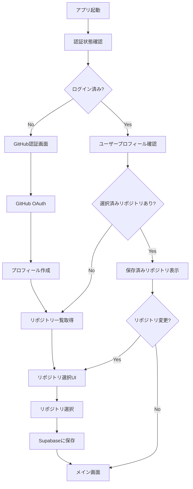

# GitHub認証・リポジトリ選択フロー設計プラン

## 概要

GitHubログイン時にリポジトリを選択し、Supabaseで記録・管理するシステムの設計プラン。ログイン時は保存済みリポジトリをGitHubから取得して表示する。

## 全体フロー



## データベース設計

### 1. profiles テーブル
```sql
CREATE TABLE profiles (
  id UUID REFERENCES auth.users(id) PRIMARY KEY,
  github_username TEXT,
  github_id BIGINT UNIQUE,
  display_name TEXT,
  avatar_url TEXT,
  created_at TIMESTAMPTZ DEFAULT NOW(),
  updated_at TIMESTAMPTZ DEFAULT NOW()
);
```

### 2. user_repositories テーブル（シンプル版）
```sql
CREATE TABLE user_repositories (
  id UUID DEFAULT gen_random_uuid() PRIMARY KEY,
  user_id UUID REFERENCES profiles(id) ON DELETE CASCADE,
  github_repo_id BIGINT NOT NULL,
  owner TEXT NOT NULL,
  name TEXT NOT NULL,
  full_name TEXT NOT NULL,
  description TEXT,
  default_branch TEXT DEFAULT 'main',
  language TEXT,
  is_selected BOOLEAN DEFAULT FALSE, -- 現在選択中のリポジトリ
  last_accessed_at TIMESTAMPTZ DEFAULT NOW(),
  created_at TIMESTAMPTZ DEFAULT NOW(),

  UNIQUE(user_id, github_repo_id)
);
```

### 3. RLS（Row Level Security）
```sql
-- profiles
ALTER TABLE profiles ENABLE ROW LEVEL SECURITY;
CREATE POLICY "Users can only see own profile" ON profiles
  FOR ALL USING (auth.uid() = id);

-- user_repositories
ALTER TABLE user_repositories ENABLE ROW LEVEL SECURITY;
CREATE POLICY "Users can only see own repositories" ON user_repositories
  FOR ALL USING (auth.uid() = user_id);
```

## フロント実装プラン

### Phase 1: 認証・プロフィール管理

#### 1. AuthProvider改良
- GitHub認証後のプロフィール作成
- トークン管理の改善
- エラーハンドリング強化

#### 2. プロフィール管理API
```typescript
// /api/profile - プロフィール取得・更新
GET  /api/profile      // 現在のユーザープロフィール取得
POST /api/profile      // プロフィール作成・更新
```

### Phase 2: リポジトリ管理

#### 1. GitHub API統合
```typescript
// lib/github.ts の拡張
class GitHubClient {
  async getUserRepos(options?: {
    sort?: 'updated' | 'created' | 'full_name'
    per_page?: number
    type?: 'all' | 'owner' | 'member'
  }): Promise<Repository[]>

  async getRepository(owner: string, repo: string): Promise<Repository>

  async checkRepositoryAccess(owner: string, repo: string): Promise<boolean>
}
```

#### 2. リポジトリ選択UI
```typescript
// components/organisms/RepositorySelector/
├── RepositorySelector.tsx     // メインコンポーネント
├── RepositoryList.tsx         // リポジトリ一覧表示
├── RepositoryCard.tsx         // 個別リポジトリカード
└── RepositorySearch.tsx       // 検索・フィルタリング
```

#### 3. Supabase API
```typescript
// API Routes
GET    /api/repositories           // ユーザーのリポジトリ一覧取得
POST   /api/repositories           // 新しいリポジトリ追加
PUT    /api/repositories/[id]      // リポジトリ情報更新
DELETE /api/repositories/[id]      // リポジトリ削除
POST   /api/repositories/select    // リポジトリ選択
```

### Phase 3: 状態管理

#### 1. Zustand Store設計
```typescript
// stores/repository.store.ts
interface RepositoryState {
  repositories: Repository[]
  selectedRepository: Repository | null
  loading: boolean
  error: string | null

  // Actions
  fetchRepositories: () => Promise<void>
  selectRepository: (repo: Repository) => Promise<void>
  clearSelection: () => void
  syncWithGitHub: () => Promise<void>
}

// stores/auth.store.ts
interface AuthState {
  user: User | null
  profile: Profile | null
  loading: boolean

  // Actions
  signIn: () => Promise<void>
  signOut: () => Promise<void>
  updateProfile: (profile: Partial<Profile>) => Promise<void>
}
```

#### 2. TanStack Query設定
```typescript
// hooks/useRepositories.ts
export const useRepositories = () => {
  return useQuery({
    queryKey: ['repositories'],
    queryFn: fetchUserRepositories,
    staleTime: 5 * 60 * 1000, // 5分間キャッシュ
  })
}

export const useSelectRepository = () => {
  return useMutation({
    mutationFn: selectRepository,
    onSuccess: () => {
      queryClient.invalidateQueries({ queryKey: ['repositories'] })
    }
  })
}
```

## 実装順序

### Week 1: 基盤構築
1. ✅ プロジェクト構造整理（完了）
2. Supabaseデータベーススキーマ作成
3. AuthProvider改良
4. API Route作成（/api/profile, /api/repositories）

### Week 2: UI実装
1. リポジトリ選択コンポーネント作成
2. ホームページ改良（選択状態表示）
3. ローディング・エラー状態の実装
4. レスポンシブデザイン対応

### Week 3: 統合・最適化
1. フロー全体の動作確認
2. パフォーマンス最適化
3. エラーハンドリング改善
4. テスト実装

## 技術的な考慮点

### セキュリティ
- **GitHub token管理**: セッション内での適切な保存・更新
- **Repository access権限**: 読み取り専用権限の確認
- **RLSによる分離**: マルチテナント環境での完全なデータ分離
- **入力検証**: APIエンドポイントでの厳格なバリデーション

### パフォーマンス
- **キャッシュ戦略**: TanStack Queryによるインテリジェントキャッシュ
- **Pagination**: 大量リポジトリでの段階的読み込み
- **差分更新**: 変更されたリポジトリのみ同期
- **Debounced search**: 検索入力の最適化

### UX
- **初回導線**: 分かりやすいオンボーディング
- **スムーズな移行**: リポジトリ変更時の状態保持
- **オフライン対応**: ネットワーク切断時の適切な表示
- **エラー回復**: 自動リトライとユーザーフレンドリーなエラー表示

## コンポーネント構成

### 画面遷移
```
1. ログイン画面 (未認証時)
   ↓
2. リポジトリ選択画面 (初回 or 変更時)
   ↓
3. メイン画面 (選択済みリポジトリ表示)
```

### 主要コンポーネント
```
├── pages/
│   ├── LoginPage              # ログイン画面
│   ├── RepositorySelectPage   # リポジトリ選択画面
│   └── MainPage              # メイン画面
├── organisms/
│   ├── Header                # 認証状態・選択リポジトリ表示
│   ├── RepositorySelector    # リポジトリ選択UI
│   └── RepositoryDisplay     # 選択済みリポジトリ表示
├── molecules/
│   ├── RepositoryCard        # リポジトリ情報カード
│   ├── SearchBar             # リポジトリ検索
│   └── LoadingSpinner        # ローディング表示
└── atoms/
    ├── Button                # 各種ボタン
    ├── Input                 # 入力フィールド
    └── Badge                 # ステータス表示
```

## RAG API連携（将来拡張）

選択されたリポジトリは既存のRAG APIと連携し、以下の機能を提供：

1. **自動同期**: リポジトリ選択時に自動的にRAG APIにデータ送信
2. **検索機能**: 選択されたリポジトリ内での意味検索
3. **チャット機能**: リポジトリコンテキストを使用したAIチャット

```typescript
// RAG API連携例
const ragClient = new RAGClient()

// リポジトリ選択時の自動同期
await ragClient.syncRepository(selectedRepository.full_name)

// 検索・チャット機能
const searchResults = await ragClient.search(query, selectedRepository.full_name)
const chatResponse = await ragClient.chat(message, selectedRepository.full_name)
```

このプランにより、シンプルで拡張可能なGitHub連携システムを構築し、将来的なRAG機能との統合も容易になります。

## API アクセスパターン

### 全体戦略
| 操作 | GitHub API | Supabase | 備考 |
|------|------------|----------|------|
| **初回ログイン** | ✅ 必須 | ✅ 必須 | プロフィール作成とリポジトリ取得 |
| **日常ログイン** | ❌ なし | ✅ 必須 | キャッシュされたデータを使用 |
| **リポジトリ選択** | ❌ なし | ✅ 必須 | 選択状態の更新のみ |
| **定期同期** | ✅ 必須 | ✅ 必須 | 1日1回の自動同期 |
| **手動更新** | ✅ 必須 | ✅ 必須 | ユーザーが明示的に要求 |

### 詳細フロー別アクセスパターン

#### 1. 初回ログイン時（新規ユーザー）
| ステップ | GitHub API | Supabase | 詳細 |
|----------|------------|----------|------|
| 1. 認証確認 | ❌ | ✅ `profiles` | プロフィール存在確認 |
| 2. GitHub情報取得 | ✅ `/user` | ❌ | ユーザー基本情報 |
| 3. プロフィール作成 | ❌ | ✅ `INSERT profiles` | GitHub情報をSupabaseに保存 |
| 4. リポジトリ一覧取得 | ✅ `/user/repos` | ❌ | 全リポジトリ取得 |
| 5. 選択UI表示 | ❌ | ❌ | フロントエンドのみ |
| 6. リポジトリ選択保存 | ❌ | ✅ `INSERT user_repositories` | 選択されたリポジトリ保存 |

**GitHub API使用回数**: 2回 (`/user`, `/user/repos`)

#### 2. 既存ユーザーログイン時
| ステップ | GitHub API | Supabase | 詳細 |
|----------|------------|----------|------|
| 1. 認証確認 | ❌ | ✅ `profiles` | 既存プロフィール確認 |
| 2. 選択済みリポジトリ取得 | ❌ | ✅ `SELECT user_repositories` | `is_selected = true` |
| 3. メイン画面表示 | ❌ | ❌ | キャッシュデータで即座に表示 |

**GitHub API使用回数**: 0回

#### 3. リポジトリ変更時
| ステップ | GitHub API | Supabase | 詳細 |
|----------|------------|----------|------|
| 1. 保存済みリポジトリ一覧 | ❌ | ✅ `SELECT user_repositories` | ユーザーの全リポジトリ |
| 2. 新しいリポジトリ追加？ | ✅ `/user/repos` (条件付き) | ❌ | 一覧にない場合のみ |
| 3. 現在選択解除 | ❌ | ✅ `UPDATE is_selected=false` | 現在の選択をクリア |
| 4. 新しい選択設定 | ❌ | ✅ `UPDATE is_selected=true` | 新しいリポジトリを選択 |

**GitHub API使用回数**: 0〜1回 (新規リポジトリの場合のみ)

#### 4. 定期同期（バックグラウンド）
| ステップ | GitHub API | Supabase | 詳細 |
|----------|------------|----------|------|
| 1. 同期対象確認 | ❌ | ✅ `SELECT user_repositories` | 保存済みリポジトリ一覧 |
| 2. GitHub最新情報取得 | ✅ `/repos/{owner}/{repo}` | ❌ | 各リポジトリの最新情報 |
| 3. 情報更新 | ❌ | ✅ `UPDATE user_repositories` | description, language等 |
| 4. 削除確認 | ✅ `/user/repos` | ❌ | アクセス権限確認 |
| 5. 削除実行 | ❌ | ✅ `DELETE user_repositories` | アクセス不可リポジトリ削除 |

**GitHub API使用回数**: N+1回 (Nは保存済みリポジトリ数)

#### 5. 手動全更新
| ステップ | GitHub API | Supabase | 詳細 |
|----------|------------|----------|------|
| 1. 全リポジトリ取得 | ✅ `/user/repos` | ❌ | 現在の全リポジトリ |
| 2. 既存データ確認 | ❌ | ✅ `SELECT user_repositories` | 現在の保存データ |
| 3. 差分計算 | ❌ | ❌ | フロントエンドで差分算出 |
| 4. 新規追加 | ❌ | ✅ `INSERT user_repositories` | 新しいリポジトリ |
| 5. 情報更新 | ❌ | ✅ `UPDATE user_repositories` | 既存リポジトリ情報 |
| 6. 削除処理 | ❌ | ✅ `DELETE user_repositories` | アクセス不可リポジトリ |

**GitHub API使用回数**: 1回

### GitHub API制限と対策

#### 基本制限値
```
REST API:        5,000 requests/hour/user
GraphQL API:     5,000 points/hour/user
Search API:      30 requests/minute/user
未認証:          60 requests/hour/IP
```

#### 使用頻度の想定
| シナリオ | 頻度 | GitHub API/日 | 理由 |
|----------|------|---------------|------|
| 初回ログイン | 1回/ユーザー | 2回 | 新規ユーザーのみ |
| 日常ログイン | 5回/日/ユーザー | 0回 | Supabaseキャッシュ使用 |
| リポジトリ変更 | 1回/週/ユーザー | 0〜1回 | 既存リポジトリなら0回 |
| 定期同期 | 1回/日/ユーザー | 5回 (平均) | 保存済みリポジトリ数に依存 |
| 手動更新 | 1回/月/ユーザー | 1回 | ユーザーが明示的に実行 |

**1ユーザーあたりの平均GitHub API使用量**: 約6回/日

### エラーハンドリング戦略

| エラー種類 | GitHub API対応 | Supabase対応 | ユーザー体験 |
|------------|----------------|--------------|--------------|
| **GitHub API制限** | リトライ + 指数バックオフ | キャッシュデータ表示 | 古いデータで継続使用可能 |
| **GitHub認証エラー** | 再認証フロー | セッションクリア | ログイン画面にリダイレクト |
| **リポジトリアクセス拒否** | スキップ | 該当データ削除 | 影響を受けたリポジトリのみ非表示 |
| **Supabase接続エラー** | GitHub APIから直接表示 | リトライ | 機能制限モードで継続 |

### キャッシュ戦略

#### キャッシュ期間設定
```typescript
const CACHE_DURATIONS = {
  profile: 24 * 60 * 60 * 1000,        // 24時間
  repositories: 60 * 60 * 1000,        // 1時間
  selectedRepository: Infinity,         // 手動更新まで永続
  githubRepoDetails: 6 * 60 * 60 * 1000 // 6時間
}
```

#### 最適化手法
```typescript
// ❌ 個別リクエスト（避けるべき）
for (const repo of repos) {
  await fetchRepoDetails(repo.id) // N回のGitHub API
}

// ✅ バッチ処理（推奨）
const repoIds = repos.map(r => r.id)
await fetchMultipleRepoDetails(repoIds) // 1回のGitHub API (GraphQL)

// ✅ 条件付きリクエスト（推奨）
const response = await github.repos.get({
  owner: 'owner',
  repo: 'repo',
  headers: {
    'If-None-Match': lastETag  // 変更なしなら304応答（制限カウントされない）
  }
})
```

### 実装における重要なポイント

1. **日常使用時はGitHub API 0回** → Supabaseキャッシュのみで高速動作
2. **初回のみGitHub API集中使用** → その後は効率的な運用
3. **エラー時もサービス継続** → 片方のAPIが落ちても影響最小限
4. **段階的なデータ同期** → 必要な時のみGitHub APIにアクセス

この設計により、GitHub API制限を大幅に削減しながら、快適なユーザー体験を提供できます。