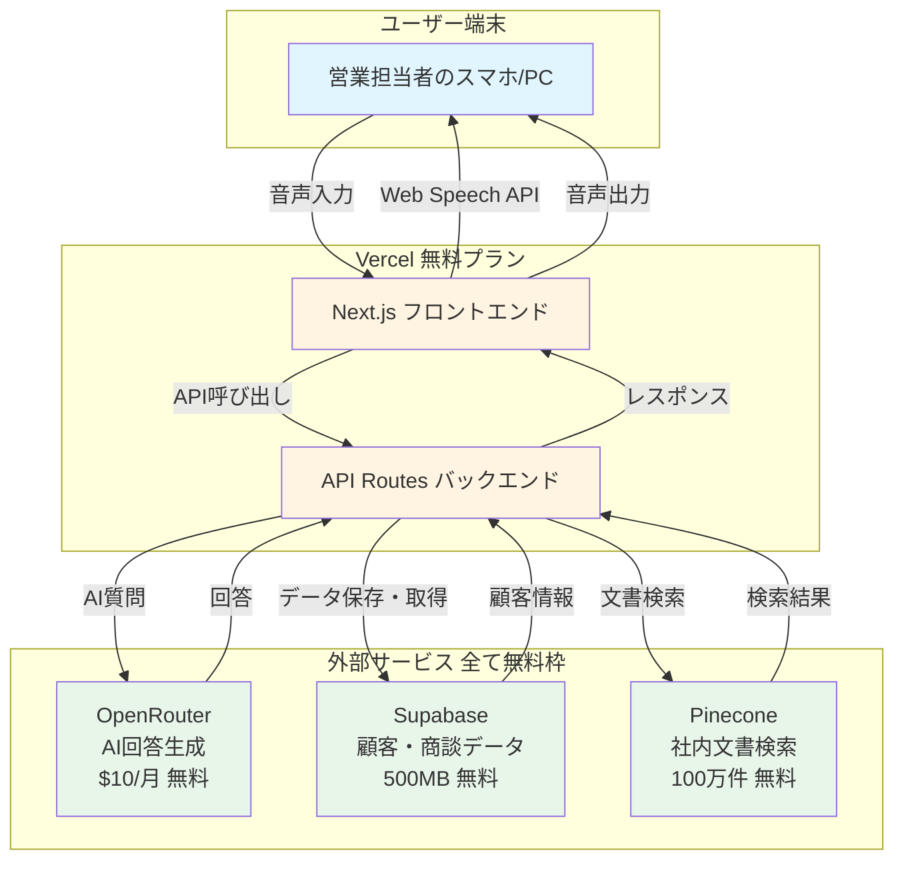
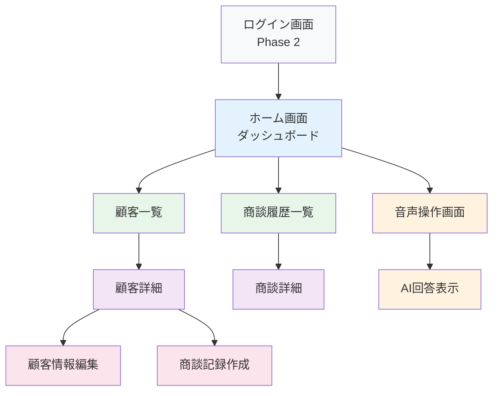
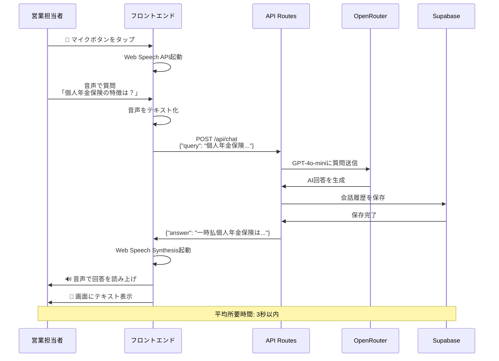
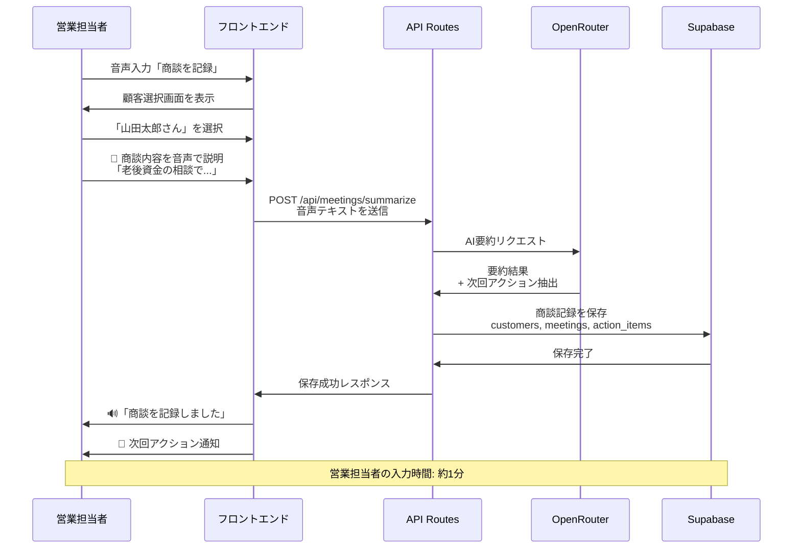
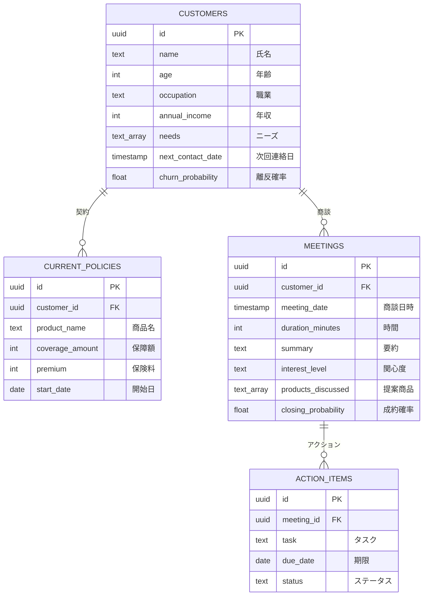
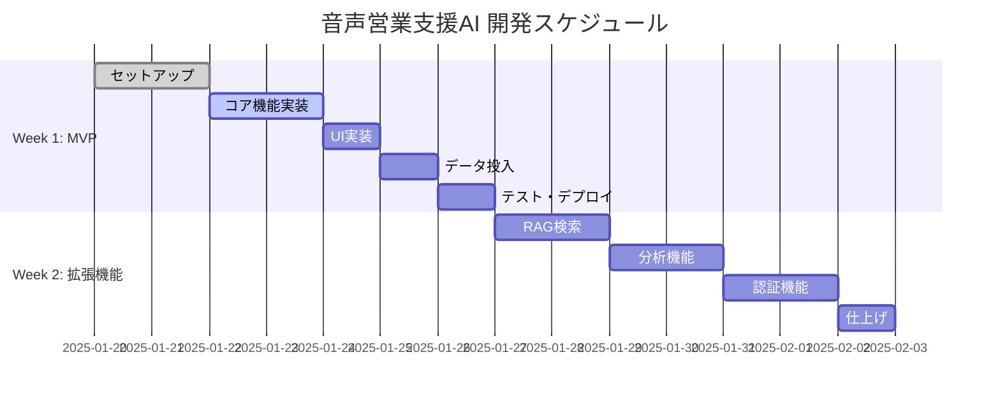
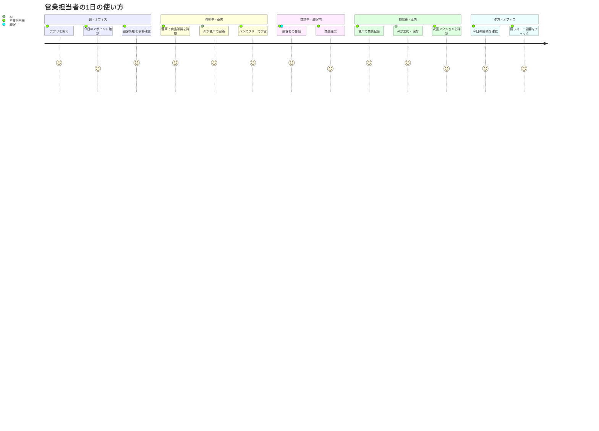
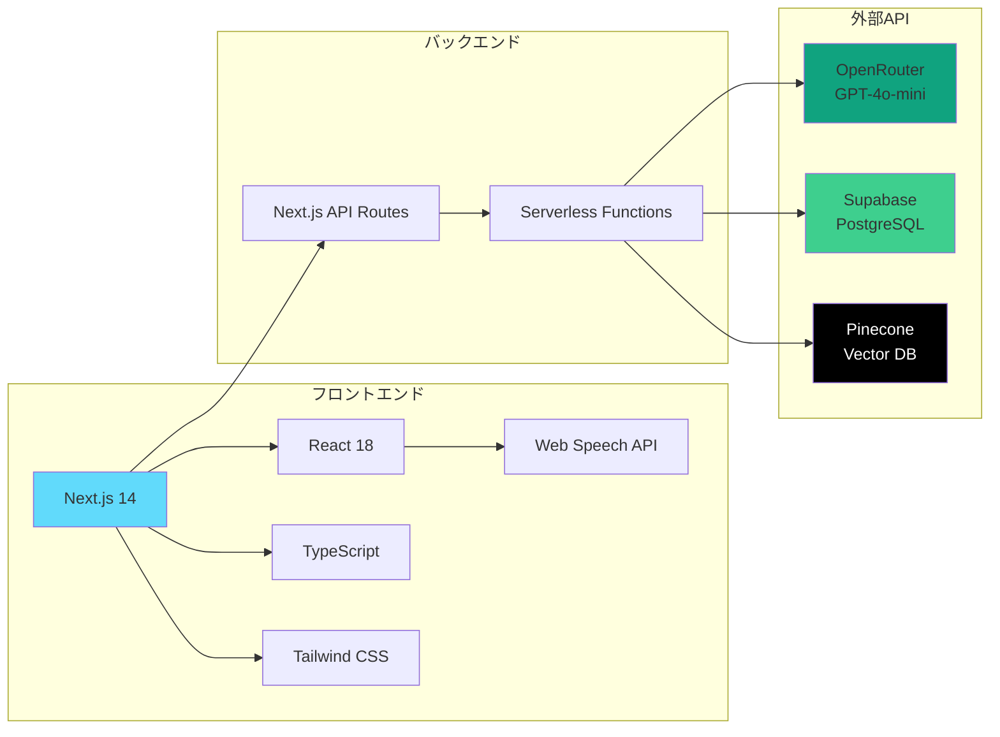
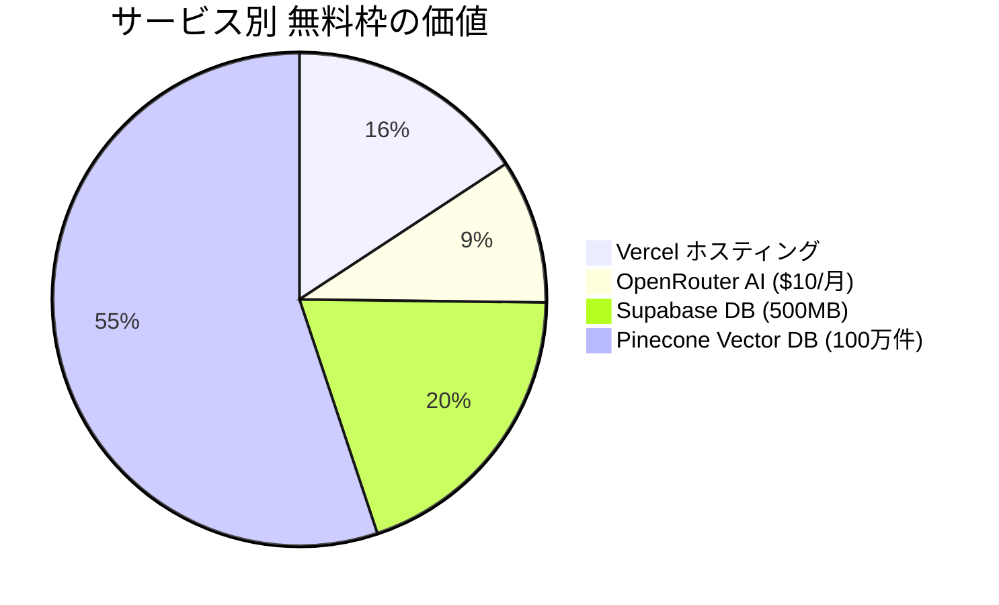

# 音声営業支援AI - 開発要件定義書

## プロジェクト概要

### プロジェクト名
**VoiceSales AI（音声営業支援アプリケーション）**

### 目的
保険営業担当者が音声で操作できる営業支援システム。商談準備、商談中のリアルタイム支援、商談後のフォローアップを音声で完結させ、営業効率を向上させる。

### 対象ユーザー
- 保険営業担当者（主要ユーザー）
- 営業マネージャー（管理・分析用）

### 開発期間
**1週間（MVP）** → 2週間（機能拡張）

### 予算
**¥0円（完全無料構成）**

---

## 機能要件

### MVP（Minimum Viable Product）- Week 1

#### 1. 音声操作機能（優先度: 高）

##### 1.1 音声認識
- **機能**: マイクボタンをタップして音声入力
- **技術**: Web Speech API（ブラウザ標準）
- **対応言語**: 日本語
- **入力方式**: タップして開始 → タップして停止
- **リアルタイム表示**: 認識中のテキストを画面に表示

**ユーザーストーリー**:
```
営業担当者として
車の移動中に音声で質問したい
なぜなら、手が塞がっていても情報を取得したいから
```

**受け入れ基準**:
- [ ] マイクボタンをタップすると音声認識が開始される
- [ ] 認識中は画面に「聞いています...」と表示される
- [ ] 認識したテキストがリアルタイムで画面に表示される
- [ ] もう一度タップすると認識が停止する
- [ ] ノイズがある環境でも認識できる（70%以上の精度）

##### 1.2 音声合成（読み上げ）
- **機能**: AI回答を音声で読み上げ
- **技術**: Web Speech Synthesis API
- **対応言語**: 日本語
- **速度調整**: 0.5x - 2.0x（設定で変更可能）

**受け入れ基準**:
- [ ] AI回答が自動的に音声で読み上げられる
- [ ] 自然な日本語のイントネーション
- [ ] 読み上げ速度を設定で変更できる
- [ ] 読み上げ中に停止ボタンで中断できる

##### 1.3 ハンズフリー操作
- **機能**: 画面を見ずに音声のみで操作
- **対応コマンド**:
  - 「次の商談相手は誰？」
  - 「山田さんの情報を教えて」
  - 「個人年金保険の特徴は？」
  - 「今日の商談を記録して」

**受け入れ基準**:
- [ ] 音声コマンドで顧客情報を取得できる
- [ ] 音声コマンドで商品情報を検索できる
- [ ] 音声コマンドで商談記録を保存できる

---

#### 2. AI回答機能（優先度: 高）

##### 2.1 一般的な質問への回答
- **機能**: LLM（GPT-4o-mini）による回答生成
- **対象**:
  - 商品知識（保険商品の特徴、メリット、デメリット）
  - 営業ノウハウ（クロージング、ヒアリング、提案方法）
  - 一般的な保険知識

**入出力例**:
```
入力: 「個人年金保険の特徴を教えて」

出力: 「一時払個人年金保険は、退職金などまとまった資金を一括で
払い込み、将来年金として受け取ることができる商品です。
主な特徴は3つです。

1つ目は、安定した運用です。元本保証型なら安心です。
2つ目は、税制優遇です。生命保険料控除が適用されます。
3つ目は、確実な年金受取です。契約時に金額が確定します。

50代から60代の退職金運用に最適です。」
```

**受け入れ基準**:
- [ ] 保険商品に関する質問に正確に回答できる
- [ ] 回答が簡潔でわかりやすい（音声向けに最適化）
- [ ] 回答時間が3秒以内
- [ ] 不明な質問には「わかりません」と正直に回答

##### 2.2 回答の音声最適化
- **機能**: 音声で聞きやすい文章に変換
- **ルール**:
  - 1文を短くする（20文字以内）
  - 専門用語を避ける
  - 数字は具体的に伝える
  - 箇条書きを「1つ目は...2つ目は...」と読み上げる

**受け入れ基準**:
- [ ] 1文が20文字以内に収まっている
- [ ] 専門用語には説明が付く
- [ ] 数字が具体的に伝えられる

---

#### 3. 顧客管理機能（優先度: 中）

##### 3.1 顧客情報の登録
- **機能**: 顧客の基本情報を登録
- **登録項目**:
  - 氏名（必須）
  - 年齢
  - 職業
  - 年収
  - 家族構成
  - 現在の契約
  - ニーズ
  - 懸念事項

**画面設計**:
```
┌─────────────────────────────────┐
│ 新規顧客登録                     │
├─────────────────────────────────┤
│ 氏名: [___________________] *   │
│ 年齢: [____] 歳                 │
│ 職業: [___________________]     │
│ 年収: [________] 万円           │
│                                 │
│ 家族構成:                       │
│ 配偶者: [あり / なし]           │
│ 子供: [__] 人                   │
│                                 │
│ ニーズ: (複数選択可)            │
│ ☐ 老後資金                      │
│ ☐ 教育費                        │
│ ☐ 医療保障                      │
│ ☐ 資産運用                      │
│                                 │
│ [登録] [キャンセル]             │
└─────────────────────────────────┘
```

**受け入れ基準**:
- [ ] 氏名を入力せずに登録できない（バリデーション）
- [ ] 登録後に顧客一覧画面に表示される
- [ ] 登録した顧客を音声で検索できる

##### 3.2 顧客情報の一覧表示
- **機能**: 登録した顧客の一覧を表示
- **表示項目**: 氏名、年齢、次回連絡日、成約確率
- **ソート**: 次回連絡日順、成約確率順
- **フィルター**: ニーズ別、年代別

**画面設計**:
```
┌─────────────────────────────────────────┐
│ 顧客一覧                  [+ 新規登録]  │
├─────────────────────────────────────────┤
│ 検索: [_______________] 🔍              │
│ フィルター: [全て ▼] [次回連絡日順 ▼] │
├─────────────────────────────────────────┤
│ ┌─────────────────────────────────┐    │
│ │ 山田太郎 (45歳)                  │    │
│ │ 次回連絡: 2025-02-15             │    │
│ │ ニーズ: 老後資金、教育費         │    │
│ │ 成約確率: 68% 🟢                 │    │
│ └─────────────────────────────────┘    │
│ ┌─────────────────────────────────┐    │
│ │ 佐藤花子 (38歳)                  │    │
│ │ 次回連絡: 2025-02-20             │    │
│ │ ニーズ: 医療保障、貯蓄           │    │
│ │ 成約確率: 45% 🟡                 │    │
│ └─────────────────────────────────┘    │
└─────────────────────────────────────────┘
```

**受け入れ基準**:
- [ ] 登録した全顧客が表示される
- [ ] 氏名で検索できる
- [ ] 次回連絡日順にソートできる
- [ ] 顧客カードをタップすると詳細画面に遷移

##### 3.3 顧客情報の詳細表示
- **機能**: 顧客の詳細情報と商談履歴を表示
- **表示内容**:
  - 基本情報
  - 現在の契約一覧
  - 過去の商談履歴
  - 推奨商品
  - 次回アクション

**受け入れ基準**:
- [ ] 顧客の全情報が表示される
- [ ] 過去の商談履歴が時系列で表示される
- [ ] 編集ボタンで情報を更新できる

---

#### 4. 商談記録機能（優先度: 中）

##### 4.1 商談の記録
- **機能**: 商談内容を記録
- **記録項目**:
  - 商談日時（自動）
  - 顧客ID（選択）
  - 商談時間
  - 商談内容の要約
  - 顧客の関心度（高/中/低）
  - 提案した商品
  - 次回アクション

**画面設計**:
```
┌─────────────────────────────────┐
│ 商談記録                         │
├─────────────────────────────────┤
│ 顧客: [山田太郎 ▼]              │
│ 日時: 2025-01-28 14:00 (自動)   │
│ 時間: [45] 分                    │
│                                 │
│ 商談内容:                       │
│ ┌─────────────────────────┐    │
│ │ 老後資金の相談。           │    │
│ │ 個人年金保険を提案。       │    │
│ │ 見積もりを送る約束。       │    │
│ └─────────────────────────┘    │
│                                 │
│ 関心度: ◉ 高 ◯ 中 ◯ 低         │
│                                 │
│ 提案商品: (複数選択可)          │
│ ☑ 個人年金保険                  │
│ ☐ 変額終身保険                  │
│                                 │
│ 次回アクション:                 │
│ ☑ 見積書を送付 (期限: 1/30)    │
│ ☑ 3日後にフォロー電話           │
│                                 │
│ [保存] [キャンセル]             │
└─────────────────────────────────┘
```

**受け入れ基準**:
- [ ] 顧客を選択して商談記録を保存できる
- [ ] 商談日時が自動で入力される
- [ ] 次回アクションが保存される
- [ ] 保存後、顧客詳細画面に履歴が表示される

##### 4.2 音声での商談記録
- **機能**: 音声で商談内容を記録
- **使い方**:
  1. 「商談を記録」と音声で言う
  2. 顧客名を選択（音声 or タップ）
  3. 商談内容を音声で話す
  4. AIが要約して保存

**入出力例**:
```
入力(音声): 「商談を記録。山田太郎さん。
今日は老後資金の相談でした。
個人年金保険を提案して、見積書を送ることになりました。
3日後にフォローの電話をします。」

AI処理:
- 顧客: 山田太郎
- 要約: 老後資金の相談。個人年金保険を提案。
- アクション:
  1. 見積書を送付
  2. 3日後にフォロー電話

出力(音声): 「商談を記録しました。次回アクションは
見積書の送付と、3日後のフォロー電話です。
リマインダーをセットしました。」
```

**受け入れ基準**:
- [ ] 音声で商談内容を入力できる
- [ ] AIが商談内容を要約する
- [ ] 次回アクションを自動抽出する
- [ ] リマインダーが自動設定される

---

#### 5. ホーム画面（優先度: 中）

##### 5.1 ダッシュボード
- **機能**: 今日のタスクと重要情報を表示
- **表示内容**:
  - 今日のアポイントメント
  - 要フォロー顧客（連絡日が過ぎている）
  - 今月の成績
  - よく使う機能へのショートカット

**画面設計**:
```
┌─────────────────────────────────────────┐
│ 🏠 ホーム                    [設定 ⚙️]  │
├─────────────────────────────────────────┤
│ 👋 おはようございます、営業太郎さん     │
│                                         │
│ 📅 今日のアポイントメント (3件)         │
│ ┌─────────────────────────────────┐    │
│ │ 14:00 山田太郎様 (顧客宅)       │    │
│ │ 16:00 佐藤花子様 (オフィス)     │    │
│ └─────────────────────────────────┘    │
│                                         │
│ ⚠️ 要フォロー (2件)                     │
│ ┌─────────────────────────────────┐    │
│ │ 鈴木一郎様 (連絡日: 1/25)       │    │
│ │ 田中次郎様 (連絡日: 1/23)       │    │
│ └─────────────────────────────────┘    │
│                                         │
│ 📊 今月の成績                           │
│ ┌─────────────────────────────────┐    │
│ │ 商談数: 28件                    │    │
│ │ 成約数: 12件 (成約率: 43%)      │    │
│ │ 目標達成率: 80% 📈              │    │
│ └─────────────────────────────────┘    │
│                                         │
│ 🎤 よく使う機能                         │
│ [音声で質問] [顧客一覧] [商談記録]     │
└─────────────────────────────────────────┘
```

**受け入れ基準**:
- [ ] 今日のアポイントメントが表示される
- [ ] 要フォロー顧客が表示される（連絡日が過ぎている）
- [ ] 今月の成績が表示される
- [ ] ショートカットボタンで各機能に遷移できる

---

### Phase 2: 拡張機能 - Week 2

#### 6. RAG検索機能（優先度: 中）

##### 6.1 社内文書の検索
- **機能**: 社内の商品資料、約款、営業ノウハウを検索
- **技術**: Pinecone（ベクトルDB）
- **対象文書**:
  - 商品パンフレット
  - 保険約款
  - 営業マニュアル
  - 成功事例集

**受け入れ基準**:
- [ ] 社内文書から正確な情報を取得できる
- [ ] 検索結果に引用元が表示される
- [ ] LLMの一般知識より社内文書を優先する

##### 6.2 ナレッジベースの管理
- **機能**: 管理者が文書を登録・更新
- **登録方法**:
  - PDFアップロード
  - テキスト直接入力
  - URLからインポート

**受け入れ基準**:
- [ ] PDFファイルをアップロードできる
- [ ] アップロードした文書が検索対象になる
- [ ] 文書を削除できる

---

#### 7. 分析・レポート機能（優先度: 低）

##### 7.1 営業成績の可視化
- **機能**: 個人・チームの成績をグラフ表示
- **表示内容**:
  - 月別の商談数・成約数
  - 商品別の成約率
  - 顧客属性別の分析

**受け入れ基準**:
- [ ] 月別の商談数が折れ線グラフで表示される
- [ ] 商品別の成約率が円グラフで表示される
- [ ] 期間を選択できる（今月、先月、今年）

---

## 非機能要件

### 1. パフォーマンス

| 項目 | 目標値 |
|------|--------|
| 音声認識開始 | 1秒以内 |
| AI回答生成 | 3秒以内 |
| 画面遷移 | 0.5秒以内 |
| API応答時間 | 2秒以内 |

**受け入れ基準**:
- [ ] 音声認識がタップから1秒以内に開始される
- [ ] AI回答が質問から3秒以内に生成される
- [ ] 画面遷移が0.5秒以内に完了する

### 2. 可用性

| 項目 | 目標値 |
|------|--------|
| 稼働率 | 99%以上 |
| ダウンタイム | 月1時間以内 |

**Vercelの無料プランで達成可能**

### 3. セキュリティ

#### 3.1 データ保護
- **顧客情報**: Supabase（暗号化）
- **API Key**: 環境変数（.env.local）
- **通信**: HTTPS必須

**受け入れ基準**:
- [ ] 顧客情報がHTTPS経由で送信される
- [ ] API Keyがコードに含まれていない
- [ ] 環境変数で管理されている

#### 3.2 認証（Phase 2）
- **方式**: Supabase Auth
- **認証方法**: メールアドレス + パスワード

**受け入れ基準**:
- [ ] ログイン画面が表示される
- [ ] 未ログイン時は機能が使えない
- [ ] ログアウトできる

### 4. ユーザビリティ

#### 4.1 レスポンシブデザイン
- **対応デバイス**: スマートフォン、タブレット、PC
- **ブレークポイント**:
  - モバイル: ~768px
  - タブレット: 769px~1024px
  - PC: 1025px~

**受け入れ基準**:
- [ ] スマートフォンで全機能が使える
- [ ] タブレットでレイアウトが崩れない
- [ ] PCで快適に操作できる

#### 4.2 PWA対応
- **機能**: ホーム画面に追加可能
- **オフライン**: 基本機能は動作（音声認識・合成）

**受け入れ基準**:
- [ ] ホーム画面に追加できる
- [ ] オフラインで音声認識が動作する
- [ ] オフライン時は適切なメッセージを表示

### 5. ブラウザ対応

| ブラウザ | バージョン | 対応状況 |
|---------|-----------|---------|
| Chrome | 最新版 | ✅ 完全対応 |
| Safari | 最新版 | ✅ 完全対応 |
| Edge | 最新版 | ✅ 完全対応 |
| Firefox | 最新版 | ⚠️ 音声認識非対応 |

**受け入れ基準**:
- [ ] Chrome、Safari、Edgeで動作する
- [ ] Firefoxでは音声認識以外が動作する

---

## 技術要件

### 1. 技術スタック

#### フロントエンド
```
Next.js 14.0+
  ├─ React 18
  ├─ TypeScript 5.0+
  ├─ Tailwind CSS 3.4+
  ├─ shadcn/ui
  └─ Zustand (状態管理)
```

#### バックエンド
```
Next.js API Routes
  └─ Serverless Functions
```

#### データベース
```
Supabase (PostgreSQL)
  ├─ 顧客テーブル
  ├─ 商談テーブル
  └─ 認証
```

#### AI/ML
```
OpenRouter API
  ├─ GPT-4o-mini
  └─ 無料枠: $10/月
```

#### ベクトル検索（Phase 2）
```
Pinecone
  ├─ 無料枠: 100万ベクトル
  └─ RAG検索
```

### 2. 環境変数

**.env.local**:
```bash
# OpenRouter (必須)
OPENROUTER_API_KEY=sk-or-xxxxx

# Supabase (必須)
NEXT_PUBLIC_SUPABASE_URL=https://xxxxx.supabase.co
NEXT_PUBLIC_SUPABASE_ANON_KEY=eyJxxxx

# Pinecone (Phase 2)
PINECONE_API_KEY=xxxxx
PINECONE_ENVIRONMENT=us-east-1-aws
PINECONE_INDEX=voice-sales-knowledge

# アプリ設定
NEXT_PUBLIC_SITE_URL=http://localhost:3000
```

### 3. API設計

#### 3.1 POST /api/chat
**リクエスト**:
```json
{
  "query": "個人年金保険の特徴は？"
}
```

**レスポンス**:
```json
{
  "answer": "一時払個人年金保険は、退職金などまとまった資金を...",
  "sources": []
}
```

#### 3.2 GET /api/customers
**レスポンス**:
```json
[
  {
    "id": "uuid",
    "name": "山田太郎",
    "age": 45,
    "needs": ["老後資金", "教育費"],
    "next_contact_date": "2025-02-15"
  }
]
```

#### 3.3 POST /api/customers
**リクエスト**:
```json
{
  "name": "山田太郎",
  "age": 45,
  "occupation": "会社員",
  "needs": ["老後資金", "教育費"]
}
```

**レスポンス**:
```json
{
  "id": "uuid",
  "name": "山田太郎",
  "created_at": "2025-01-28T10:00:00Z"
}
```

#### 3.4 POST /api/meetings
**リクエスト**:
```json
{
  "customer_id": "uuid",
  "duration_minutes": 45,
  "summary": "老後資金の相談。個人年金保険を提案。",
  "interest_level": "high",
  "products_discussed": ["個人年金保険"]
}
```

**レスポンス**:
```json
{
  "id": "uuid",
  "customer_id": "uuid",
  "created_at": "2025-01-28T14:00:00Z"
}
```

---

## データベース設計

### 1. テーブル定義

#### customers テーブル
```sql
CREATE TABLE customers (
  id UUID PRIMARY KEY DEFAULT gen_random_uuid(),
  name TEXT NOT NULL,
  age INTEGER,
  gender TEXT,
  occupation TEXT,
  company TEXT,
  annual_income INTEGER,
  marital_status TEXT,
  children_count INTEGER,
  needs TEXT[],
  concerns TEXT[],
  risk_tolerance TEXT CHECK (risk_tolerance IN ('low', 'medium', 'high')),
  next_contact_date TIMESTAMP,
  churn_probability FLOAT DEFAULT 0,
  lifetime_value INTEGER DEFAULT 0,
  created_at TIMESTAMP DEFAULT NOW(),
  updated_at TIMESTAMP DEFAULT NOW()
);

CREATE INDEX idx_customers_name ON customers(name);
CREATE INDEX idx_customers_next_contact_date ON customers(next_contact_date);
```

#### current_policies テーブル（顧客の現在の契約）
```sql
CREATE TABLE current_policies (
  id UUID PRIMARY KEY DEFAULT gen_random_uuid(),
  customer_id UUID REFERENCES customers(id) ON DELETE CASCADE,
  product_name TEXT NOT NULL,
  coverage_amount INTEGER,
  premium INTEGER,
  start_date DATE,
  created_at TIMESTAMP DEFAULT NOW()
);

CREATE INDEX idx_policies_customer_id ON current_policies(customer_id);
```

#### meetings テーブル
```sql
CREATE TABLE meetings (
  id UUID PRIMARY KEY DEFAULT gen_random_uuid(),
  customer_id UUID REFERENCES customers(id) ON DELETE CASCADE,
  meeting_date TIMESTAMP NOT NULL DEFAULT NOW(),
  duration_minutes INTEGER,
  summary TEXT,
  transcript TEXT,
  interest_level TEXT CHECK (interest_level IN ('low', 'medium', 'high')),
  products_discussed TEXT[],
  closing_probability FLOAT DEFAULT 0,
  created_at TIMESTAMP DEFAULT NOW()
);

CREATE INDEX idx_meetings_customer_id ON meetings(customer_id);
CREATE INDEX idx_meetings_date ON meetings(meeting_date DESC);
```

#### action_items テーブル（商談後のアクション）
```sql
CREATE TABLE action_items (
  id UUID PRIMARY KEY DEFAULT gen_random_uuid(),
  meeting_id UUID REFERENCES meetings(id) ON DELETE CASCADE,
  task TEXT NOT NULL,
  due_date DATE,
  status TEXT CHECK (status IN ('pending', 'completed', 'cancelled')) DEFAULT 'pending',
  created_at TIMESTAMP DEFAULT NOW(),
  completed_at TIMESTAMP
);

CREATE INDEX idx_action_items_meeting_id ON action_items(meeting_id);
CREATE INDEX idx_action_items_due_date ON action_items(due_date);
CREATE INDEX idx_action_items_status ON action_items(status);
```

---

## Mermaid図解

### 1. システム構成図



### 2. 画面遷移図



### 3. データフロー図（音声質問の流れ）



### 4. 商談記録の流れ



### 5. データベース関連図



### 6. 開発スケジュール（ガントチャート）



### 7. ユーザー利用フロー（営業担当者の1日）



### 8. 技術スタック構成



### 9. コスト構成（全て無料！）



---

## 画面遷移図（ASCII版）

```
┌─────────────┐
│   ログイン   │ (Phase 2)
└──────┬──────┘
       ↓
┌─────────────┐
│   ホーム     │
│ (ダッシュ    │
│  ボード)     │
└──┬────┬──┬──┘
   │    │  │
   ↓    ↓  ↓
┌──────┐┌────────┐┌──────────┐
│音声  ││顧客一覧││商談履歴  │
│操作  │└────┬───┘└──────────┘
│      │     ↓
│      │┌────────┐
│      ││顧客詳細│
└──────┘│        │
        │  ├─────┐
        │  │商談 │
        │  │記録 │
        └──┴─────┘
```

---

## 開発スケジュール

### Week 1: MVP開発

#### Day 1-2: セットアップ
- [x] Next.jsプロジェクト作成
- [x] 依存関係インストール
- [x] OpenRouter登録・API Key取得
- [x] Supabase登録・プロジェクト作成
- [x] テーブル作成
- [x] 環境変数設定

#### Day 3-4: コア機能実装
- [ ] 音声認識フック実装
- [ ] 音声合成フック実装
- [ ] AI回答API実装
- [ ] 顧客管理API実装
- [ ] 商談記録API実装

#### Day 5: UI実装
- [ ] 音声操作画面
- [ ] 顧客一覧画面
- [ ] 顧客詳細画面
- [ ] 商談記録画面
- [ ] ホーム画面

#### Day 6: データ投入
- [ ] モック顧客データ作成
- [ ] モック商談データ作成
- [ ] システムプロンプト調整

#### Day 7: テスト・デプロイ
- [ ] 動作確認
- [ ] バグフィックス
- [ ] Vercelデプロイ
- [ ] デモ準備

### Week 2: 拡張機能

#### Day 8-9: RAG検索
- [ ] Pinecone登録
- [ ] ベクトルDB接続
- [ ] ナレッジベース投入
- [ ] RAG検索API実装

#### Day 10-11: 分析機能
- [ ] 成績集計ロジック
- [ ] グラフコンポーネント
- [ ] レポート画面

#### Day 12-13: 認証機能
- [ ] Supabase Auth設定
- [ ] ログイン画面
- [ ] 認証ミドルウェア

#### Day 14: 仕上げ
- [ ] 全機能テスト
- [ ] パフォーマンス最適化
- [ ] ドキュメント作成

---

## テスト計画

### 1. 単体テスト

#### 音声認識フック
```typescript
describe('useVoiceRecognition', () => {
  it('音声認識を開始できる', () => {
    // テストコード
  });

  it('音声認識を停止できる', () => {
    // テストコード
  });

  it('認識したテキストが取得できる', () => {
    // テストコード
  });
});
```

### 2. 統合テスト

#### AI回答API
```typescript
describe('POST /api/chat', () => {
  it('質問に対して回答を返す', async () => {
    const response = await fetch('/api/chat', {
      method: 'POST',
      body: JSON.stringify({ query: '個人年金保険の特徴は？' }),
    });

    expect(response.status).toBe(200);
    const data = await response.json();
    expect(data.answer).toBeDefined();
  });
});
```

### 3. E2Eテスト（手動）

#### シナリオ1: 音声で顧客情報を取得
1. 音声操作画面を開く
2. マイクボタンをタップ
3. 「山田太郎さんの情報を教えて」と話す
4. マイクボタンをタップ（停止）
5. AI回答が表示される
6. 音声で読み上げられる

**期待結果**: 山田太郎さんの情報が音声で伝えられる

#### シナリオ2: 商談記録を保存
1. ホーム画面から「商談記録」をタップ
2. 顧客を選択
3. 商談内容を入力
4. 関心度を選択
5. 「保存」をタップ

**期待結果**: 商談が保存され、顧客詳細画面に表示される

---

## リリース基準

### MVP（Week 1）のリリース基準

- [ ] 音声認識が動作する（Chrome、Safari、Edge）
- [ ] AI回答が3秒以内に返ってくる
- [ ] 顧客情報を登録・一覧表示できる
- [ ] 商談記録を保存できる
- [ ] スマートフォンで全機能が使える
- [ ] Vercelにデプロイされている
- [ ] 環境変数が正しく設定されている
- [ ] 致命的なバグがない

### Phase 2（Week 2）のリリース基準

- [ ] RAG検索が動作する
- [ ] 社内文書から正確な情報を取得できる
- [ ] 成績グラフが表示される
- [ ] 認証機能が動作する
- [ ] パフォーマンスが目標値を満たす

---

## リスク管理

### 技術リスク

| リスク | 影響度 | 対策 |
|--------|--------|------|
| Web Speech APIの精度が低い | 高 | 事前にテスト環境で検証 |
| OpenRouterの無料枠超過 | 中 | 使用量を監視、超過時は有料プラン |
| Supabaseの容量不足 | 低 | 古いデータを定期削除 |

### スケジュールリスク

| リスク | 影響度 | 対策 |
|--------|--------|------|
| 1週間でMVP完成しない | 高 | 機能を削減、音声機能に集中 |
| バグ修正に時間がかかる | 中 | テストを早めに実施 |

---

## 成功指標（KPI）

### 開発フェーズ

- [ ] MVP完成: 7日以内
- [ ] デプロイ成功: 初回で成功
- [ ] 致命的バグ: 0件

### 利用フェーズ（デモ後）

- 音声認識の利用率: 70%以上
- AI回答の満足度: 80%以上
- 商談記録の入力時間: 5分 → 1分
- 営業担当者からのフィードバック: 「使いやすい」が80%以上

---

## 納品物

### ソースコード
- GitHubリポジトリ
- README.md（セットアップ手順）

### ドキュメント
- API仕様書
- データベース設計書
- 画面設計書
- テスト結果報告書

### デプロイ環境
- Vercel本番環境
- URL: https://your-app.vercel.app

---

## サポート・保守

### バグ修正
- 致命的バグ: 24時間以内に対応
- 軽微なバグ: 1週間以内に対応

### 機能追加
- 要望に応じて追加開発
- 見積もりは個別に提示

---

## 参考資料

### 技術ドキュメント
- Next.js: https://nextjs.org/docs
- Supabase: https://supabase.com/docs
- OpenRouter: https://openrouter.ai/docs
- Web Speech API: https://developer.mozilla.org/en-US/docs/Web/API/Web_Speech_API

### 関連ドキュメント
- [08_voice_sales_assistant.md](./08_voice_sales_assistant.md) - 機能一覧
- [10_voice_sales_app_architecture.md](./10_voice_sales_app_architecture.md) - アーキテクチャ設計
- [11_voice_sales_free_architecture.md](./11_voice_sales_free_architecture.md) - 無料構成

---

## 改訂履歴

| バージョン | 日付 | 変更内容 | 作成者 |
|-----------|------|---------|--------|
| 1.0 | 2025-01-28 | 初版作成 | Claude |

---

## 承認

| 役割 | 氏名 | 承認日 | 署名 |
|------|------|--------|------|
| プロジェクトマネージャー | | | |
| 技術責任者 | | | |
| 営業責任者 | | | |

---

**以上**

この要件定義書をもとに開発を開始してください。
不明点があれば、いつでも質問してください。
