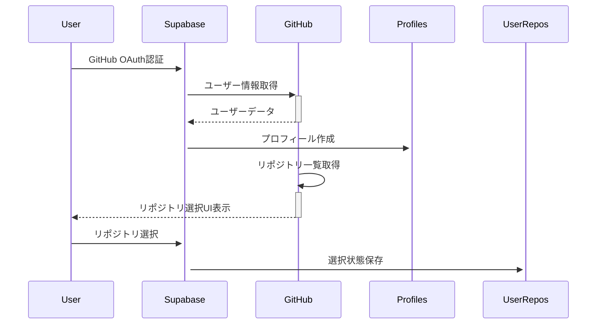
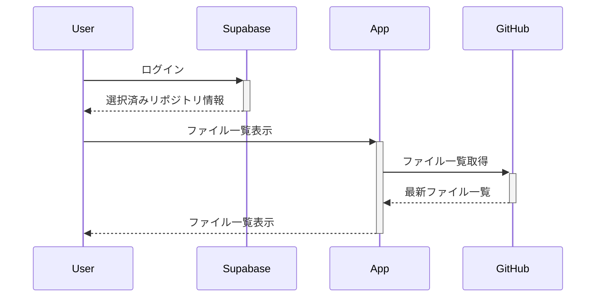
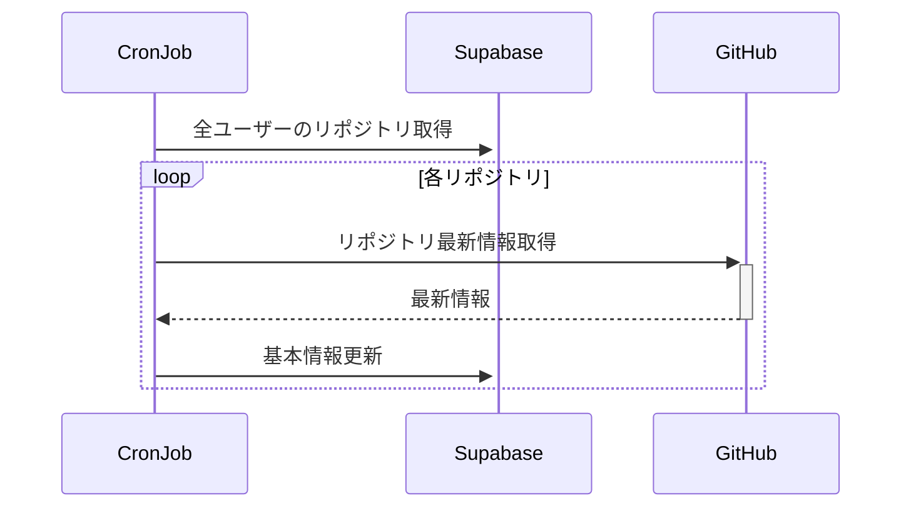

# Supabaseデータ管理設計

## 概要

本ドキュメントでは、RAGシステムのフロントエンドでSupabaseが管理するデータの範囲と役割を明確に定義します。GitHubとの適切な役割分担により、高速性と最新性を両立します。

## Supabaseで管理するデータ

### 1. profiles テーブル

#### 用途
ユーザーの基本情報とGitHubアカウントの紐付け管理

#### スキーマ
```sql
CREATE TABLE profiles (
  id UUID REFERENCES auth.users(id) PRIMARY KEY,
  github_username TEXT,
  github_id BIGINT UNIQUE,
  display_name TEXT,
  avatar_url TEXT,
  created_at TIMESTAMPTZ DEFAULT NOW(),
  updated_at TIMESTAMPTZ DEFAULT NOW()
);
```

#### 格納データ
| フィールド | 説明 | 例 |
|------------|------|-----|
| `id` | Supabase認証のユーザーID | `550e8400-e29b-41d4-a716-446655440000` |
| `github_username` | GitHubユーザー名 | `"wasborn14"` |
| `github_id` | GitHub内部ID | `12345678` |
| `display_name` | 表示名 | `"Taro Yamada"` |
| `avatar_url` | プロフィール画像URL | `"https://avatars.githubusercontent.com/..."` |
| `created_at` | アカウント作成日時 | `2024-01-15T10:30:00Z` |
| `updated_at` | 最終更新日時 | `2024-01-20T15:45:00Z` |

### 2. user_repositories テーブル

#### 用途
ユーザーが選択・登録したリポジトリの選択状態と基本情報の管理

#### スキーマ
```sql
CREATE TABLE user_repositories (
  id UUID DEFAULT gen_random_uuid() PRIMARY KEY,
  user_id UUID REFERENCES profiles(id) ON DELETE CASCADE,
  github_repo_id BIGINT NOT NULL,
  owner TEXT NOT NULL,
  name TEXT NOT NULL,
  full_name TEXT NOT NULL,
  description TEXT,
  default_branch TEXT DEFAULT 'main',
  language TEXT,
  is_selected BOOLEAN DEFAULT FALSE,
  last_accessed_at TIMESTAMPTZ DEFAULT NOW(),
  created_at TIMESTAMPTZ DEFAULT NOW(),
  updated_at TIMESTAMPTZ DEFAULT NOW(),

  UNIQUE(user_id, github_repo_id)
);
```

#### 格納データ
| フィールド | 説明 | 例 |
|------------|------|-----|
| `id` | 内部UUID | `550e8400-e29b-41d4-a716-446655440001` |
| `user_id` | 所有ユーザーID | `550e8400-e29b-41d4-a716-446655440000` |
| `github_repo_id` | GitHubリポジトリID | `87654321` |
| `owner` | リポジトリ所有者 | `"wasborn14"` |
| `name` | リポジトリ名 | `"my-awesome-project"` |
| `full_name` | 完全名 | `"wasborn14/my-awesome-project"` |
| `description` | 説明文 | `"A sample project for demonstrating..."` |
| `default_branch` | デフォルトブランチ | `"main"` |
| `language` | 主要言語 | `"TypeScript"` |
| `is_selected` | 現在選択中フラグ | `true` |
| `last_accessed_at` | 最終アクセス日時 | `2024-01-20T16:00:00Z` |
| `created_at` | 登録日時 | `2024-01-15T11:00:00Z` |
| `updated_at` | 最終更新日時 | `2024-01-20T16:00:00Z` |

## Supabaseで管理**しない**データ

### ファイル・フォルダ情報
```
❌ ファイル一覧 (README.md, docs/guide.md, etc.)
❌ フォルダ構造 (src/, docs/, tests/)
❌ ファイル内容 (Markdownテキスト、ソースコード)
❌ ファイルサイズ (1.2KB, 15.3MB)
❌ ファイル最終更新日時 (2024-01-20T14:30:00Z)
```

**理由**:
- データ量が膨大になる可能性
- 頻繁な変更でキャッシュ管理が複雑
- GitHub APIから都度取得で最新性確保

### リポジトリの詳細情報
```
❌ コミット履歴
❌ ブランチ一覧
❌ Issue・Pull Request
❌ Contributors情報
❌ Stars・Forks数
❌ リリース情報
```

**理由**:
- アプリの主目的（ドキュメント閲覧・RAG）に不要
- GitHub APIで必要時取得が効率的

### リアルタイム変更情報
```
❌ 新ファイル作成の即座反映
❌ ファイル内容の変更検知
❌ ブランチ切り替え
❌ コミット通知
```

**理由**:
- GitHub APIで常に最新を表示
- Webhooks実装の複雑性回避

## データ取得パターン

### Supabaseから取得する場面

#### 1. ログイン時の状態復元
```typescript
// 選択済みリポジトリの取得
const getSelectedRepository = async (userId: string) => {
  const { data } = await supabase
    .from('user_repositories')
    .select('name, full_name, owner, description, language')
    .eq('user_id', userId)
    .eq('is_selected', true)
    .single()

  return data
}
```

#### 2. リポジトリ選択画面での一覧表示
```typescript
// ユーザーの登録済みリポジトリ一覧
const getUserRepositories = async (userId: string) => {
  const { data } = await supabase
    .from('user_repositories')
    .select('*')
    .eq('user_id', userId)
    .order('last_accessed_at', { ascending: false })

  return data
}
```

#### 3. リポジトリ選択状態の変更
```typescript
// 現在の選択を解除し、新しいリポジトリを選択
const selectRepository = async (userId: string, repositoryId: string) => {
  // 現在の選択を解除
  await supabase
    .from('user_repositories')
    .update({ is_selected: false })
    .eq('user_id', userId)
    .eq('is_selected', true)

  // 新しいリポジトリを選択
  await supabase
    .from('user_repositories')
    .update({
      is_selected: true,
      last_accessed_at: new Date().toISOString()
    })
    .eq('id', repositoryId)
}
```

### GitHub APIから取得する場面

#### 1. ファイル・フォルダ一覧
```typescript
// 指定パスのファイル一覧取得
const getRepositoryContents = async (owner: string, repo: string, path: string = '') => {
  const response = await github.repos.getContent({
    owner,
    repo,
    path
  })

  return Array.isArray(response.data) ? response.data : [response.data]
}
```

#### 2. ファイル内容取得
```typescript
// 指定ファイルの内容取得
const getFileContent = async (owner: string, repo: string, path: string) => {
  const response = await github.repos.getContent({
    owner,
    repo,
    path
  })

  // Base64デコード
  const content = Buffer.from(response.data.content, 'base64').toString()
  return content
}
```

#### 3. リポジトリ最新情報（手動同期時）
```typescript
// リポジトリの基本情報を最新に更新
const syncRepositoryInfo = async (owner: string, repo: string) => {
  const response = await github.repos.get({ owner, repo })

  // Supabaseの情報を更新
  await supabase
    .from('user_repositories')
    .update({
      description: response.data.description,
      language: response.data.language,
      updated_at: response.data.updated_at
    })
    .eq('github_repo_id', response.data.id)
}
```

## データ同期戦略

### 初回ログイン時


### 日常使用時


### 定期同期（1日1回）


## パフォーマンス最適化

### キャッシュ戦略
```typescript
// TanStack Queryでのキャッシュ設定
const CACHE_CONFIG = {
  // Supabaseデータ（変更頻度低）
  selectedRepository: {
    staleTime: 60 * 60 * 1000,    // 1時間
    cacheTime: 24 * 60 * 60 * 1000 // 24時間
  },

  // GitHub APIデータ（変更頻度高）
  fileList: {
    staleTime: 5 * 60 * 1000,     // 5分
    cacheTime: 10 * 60 * 1000     // 10分
  },

  fileContent: {
    staleTime: 2 * 60 * 1000,     // 2分
    cacheTime: 5 * 60 * 1000      // 5分
  }
}
```

### インデックス設定
```sql
-- パフォーマンス向上のためのインデックス
CREATE INDEX idx_profiles_github_id ON profiles(github_id);
CREATE INDEX idx_user_repositories_user_id ON user_repositories(user_id);
CREATE INDEX idx_user_repositories_selected ON user_repositories(user_id, is_selected)
  WHERE is_selected = true;
CREATE INDEX idx_user_repositories_github_id ON user_repositories(github_repo_id);
```

## セキュリティ・権限管理

### Row Level Security (RLS)
```sql
-- profiles テーブルのRLS
ALTER TABLE profiles ENABLE ROW LEVEL SECURITY;
CREATE POLICY "Users can manage own profile" ON profiles
  FOR ALL USING (auth.uid() = id);

-- user_repositories テーブルのRLS
ALTER TABLE user_repositories ENABLE ROW LEVEL SECURITY;
CREATE POLICY "Users can manage own repositories" ON user_repositories
  FOR ALL USING (auth.uid() = user_id);
```

## 実装時の注意点

### データ整合性
1. **一意制約**: 1ユーザーにつき1つのリポジトリのみ選択可能
2. **外部キー制約**: プロフィール削除時のカスケード削除
3. **トリガー**: `updated_at`の自動更新

### エラーハンドリング
1. **GitHub API制限**: Supabaseデータで継続利用
2. **ネットワークエラー**: キャッシュデータの活用
3. **認証エラー**: 適切なリダイレクト処理

### 将来拡張への対応
1. **複数リポジトリ選択**: `is_selected`をboolean配列に変更可能
2. **ファイル管理**: 必要に応じてファイルテーブル追加可能
3. **チーム機能**: ユーザーグループテーブル追加可能

この設計により、Supabaseは「ユーザーの選択状態と基本情報のキャッシュ」という明確な役割を持ち、GitHub APIは「最新のコンテンツ提供」を担当することで、効率的で拡張性の高いシステムを実現します。